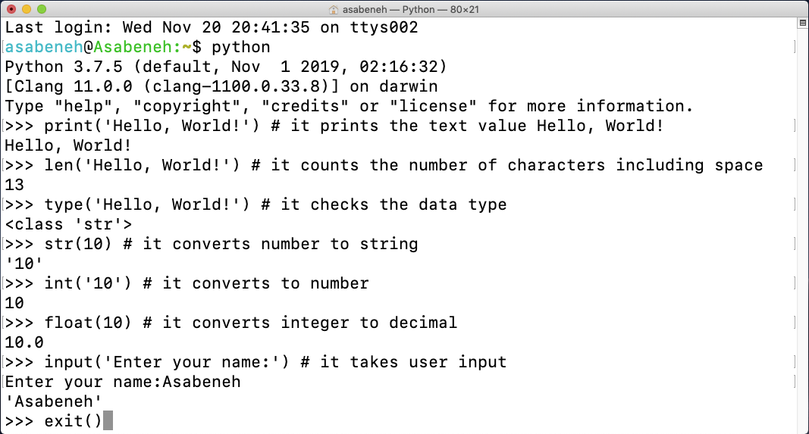

- [📘 Day 2](#-day-2)
  - [Built in functions](#built-in-functions)
      - [**Example**](#example)
      - [**Example**](#example-1)
  - [Variables](#variables)
      - [**Example**](#example-2)
      - [**Example**:](#example-3)
      - [**Example:**](#example-4)
      - [**Example:**](#example-5)
      - [**Example:**](#example-6)
      - [**Example:**](#example-7)
  - [Data Types](#data-types)
  - [Checking Data types and Casting](#checking-data-types-and-casting)
  - [Numbers](#numbers)
  - [💻 Exercises - Day 2](#-exercises---day-2)
    - [Exercises: Level 1](#exercises-level-1)
    - [Exercises: Level 2](#exercises-level-2)

# 📘 Day 2

## Built in functions

Built-in functions are globally available for your use that mean you can make use of the built-in functions without importing or configuring. Some of the most commonly used Python built-in functions are the following: 

```py

print(), 
len(), 
type(), 
int(), 
float(),
str(),
input(), 
list(), 
dict(), 
min(), 
max(), 
sum(), 
sorted(), 
open(), 
file(), 
help(), 
dir()

```


#### **Example**



```py

print('Hello, World!') # Hello, World!
len('Hello, World!') # 13
type('Hello, World!') # <class 'str'>
str(10)
int('10')
float(10)
input('Enter your name:')


a = 12
b = -4
c = 3+4j
d = 7.90
print(abs(a))
print(abs(b))
print(abs(c))
print(abs(d))


tuple = (0, True, False)
x = all(tuple)
print(x)


sampledict = {0 : "Apple", 1 : "Orange"}
x = all(sampledict)
print(x)


myset = {0, 1, 0}
x = any(myset)
print(x)


a=5
print(bin(a))


print(round(4.5))
print(round(-7.7))


print(bin(4))
print(bin(9))


print(bool(0))
print(bool(-4.5))
print(bool(None))
print(bool("False"))


# Syntax: bytearray(source,encoding,errors)

'''
The values to function are optional.
If any non-ascii value is given to the function, it gives the error -TypeError: string argument without an encoding.
'''

print(bytearray())
print(bytearray('Python','utf-8'))


# Syntax: Compile(source,filename,mode,flags=0,dont_inherit=False,optimize=-1)

myCode = 'a = 7\nb=9\nresult=a*b\nprint("result =",result)'
codeObject = compile(myCode, 'resultstring', 'exec')
exec(codeObject)


# Syntax: list([iterable])

print(list()) #returns empty list
stringobj = 'PALINDROME'
print(list(stringobj))
tupleobj = ('a', 'e', 'i', 'o', 'u')
print(list(tupleobj))
listobj = ['1', '2', '3', 'o', '10u']
print(list(listobj))


# Syntax: len([object])

stringobj = 'PALINDROME'
print(len(stringobj))
tupleobj = ('a', 'e', 'i', 'o', 'u')
print(len(tupleobj))
listobj = ['1', '2', '3', 'o', '10u']
print(len(listobj))


# Syntax: input()


# Syntax: callable(Object)

def myFun(): 
    return 5
res = myFun 
print(callable(res)) #function is called to get this value
num1 = 15 * 5
print(callable(num1))#no function is called 


# Syntax: type(Object)
# Syntax: type(name,bases,dict)

tupleObj=(3,4,6,7,9)
print(type(tupleObj))
new1 = type('New', (object, ),
dict(var1 ='LetsLearn', b = 2029))
print(type(new1))


# Syntax: str(object,encoding,errors)

print(str('A1323'))
b = bytes('pythön', encoding='utf-8')
print(str(b, encoding='ascii', errors='ignore'))
#errors='ignore' helps interpreter to ignore when it found a non Ascii charact


# Syntax: sum([iterable],start)

num = [2.5, 3, 4, -5]
numSum = sum(num)
print(numSum)
numSum = sum(num, 20)
print(numSum)


# Syntax: sorted(iterable,key,reverse)

sampleObj = (3,6,8,2,5,8,10)
print(sorted(sampleObj,reverse=True))
sampledict = {'a':'sss','g':'wq','t':2}
print(sorted(sampledict,key= len))


# Syntax: oct(number)

print("The octal representation of 32 is " + oct(32)) 
print("The octal representation of the"
    " ascii value of 'A' is " + oct(ord('A'))) 
print("The octal representation of the binary" " of 32 is " + oct(100000)) 
print("The octal representation of the binary"
                " of 23 is " + oct(0x17))


# Syntax: pow(num1,num2)

print(pow(2,-3))
print(pow(2,4.5))
print(pow(3,0))


# open(file, mode)

f = open("myFile.txt", "r")#read mode
print(f.read())


# Syntax: map(fun,[Iterable])

numList = (11, 21, 13, 41)
res = map(lambda x: x + x, numList)
print(list(res))


# Syntax: max(iterable) or max(num1,num2…)

num = [11, 13, 12, 15, 14]
print('Maximum is:', max(num))


# Syntax: min([iterable])

print(min(2,5,3,1,0,99))
sampleObj = ['B','a','t','A']
print(min(sampleObj))


# Syntax: range(start,stop,step)

res = 1
for i in range(1, 10,2): 
       res = res * i 
print("multiplication of first 10 natural number :", res)

# Syntax: reversed([sequence] or [collection])
tupleObj=(3,4,6,7,9)
for i in reversed(tupleObj): 
       print(i,end=' ')


```
printing all python reserved words using   help('keywords')

```py

help('keywords')

```


As you can see from the terminal above, Python has got reserved words. We do not use reserved words to declare variables or functions. We will cover variables in the next section.

#### **Example**


## Variables

Variables store data in a computer memory.

Python Variable Name Rules

- A variable name must start with a letter or the underscore character
- A variable name cannot start with a number
- A variable name can only contain alpha-numeric characters and underscores (A-z, 0-9, and _ )
- Variable names are case-sensitive (firstname, Firstname, FirstName and FIRSTNAME) are different variables)

#### **Example**

```shell
firstname
lastname
age
country
city
first_name
last_name
capital_city
_if # if we want to use reserved word as a variable
year_2021
year2021
current_year_2021
birth_year
num1
num2
```

Invalid variables names

```shell
first-name
first@name
first$name
num-1
1num
```

Taking value to the variable

#### **Example**:

```py
# Variables in Python
first_name = 'Asabeneh'
last_name = 'Yetayeh'
country = 'Finland'
city = 'Helsinki'
age = 250
is_married = True
skills = ['HTML', 'CSS', 'JS', 'React', 'Python']
person_info = {
   'firstname':'Asabeneh',
   'lastname':'Yetayeh',
   'country':'Finland',
   'city':'Helsinki'
   }
```

Let us use the _print()_ and _len()_ built-in functions. 

#### **Example:**

```py
print('Hello, World!') # The text Hello, World! is an argument
print('Hello',',', 'World','!') # it can take multiple arguments, four arguments have been passed
print(len('Hello, World!')) # it takes only one argument
```

Let us print and also find the length of the variables declared at the top:

#### **Example:**

```py
# Printing the values stored in the variables

print('First name:', first_name)
print('First name length:', len(first_name))
print('Last name: ', last_name)
print('Last name length: ', len(last_name))
print('Country: ', country)
print('City: ', city)
print('Age: ', age)
print('Married: ', is_married)
print('Skills: ', skills)
print('Person information: ', person_info)
```

Declaring Multiple Variable in a Line

#### **Example:**

```py
first_name, last_name, country, age, is_married = 'Asabeneh', 'Yetayeh', 'Helsink', 250, True

print(first_name, last_name, country, age, is_married)
print('First name:', first_name)
print('Last name: ', last_name)
print('Country: ', country)
print('Age: ', age)
print('Married: ', is_married)
```

Getting user input using the _input()_ built-in function. 

#### **Example:**

```py
first_name = input('What is your name: ')
age = input('How old are you? ')

print(first_name)
print(age)
```

## Data Types

There are several data types in Python. To identify the data type we use the _type_ built-in function. 

## Checking Data types and Casting

- Check Data types: To check the data type of certain data/variable we use the _type_

  **Example:**

```py
# Different python data types
# Let's declare variables with various data types

first_name = 'Asabeneh'     # str
last_name = 'Yetayeh'       # str
country = 'Finland'         # str
city= 'Helsinki'            # str
age = 250                   # int, it is not my real age, don't worry about it

# Printing out types
print(type('Asabeneh'))     # str
print(type(first_name))     # str
print(type(10))             # int
print(type(3.14))           # float
print(type(1 + 1j))         # complex
print(type(True))           # bool
print(type([1, 2, 3, 4]))     # list
print(type({'name':'Asabeneh','age':250, 'is_married':250}))    # dict
print(type((1,2)))                                              # tuple
print(type(zip([1,2],[3,4])))                                   # set
```

- Casting: Converting one data type to another data type. We use _int()_, _float()_, _str()_, _list_, _set_
   
**Example:**

```py
# int to float
num_int = 10
print('num_int',num_int)         # 10
num_float = float(num_int)
print('num_float:', num_float)   # 10.0

# float to int
gravity = 9.81
print(int(gravity))             # 9

# int to str
num_int = 10
print(num_int)                  # 10
num_str = str(num_int)
print(num_str)                  # '10'

# str to int or float
num_str = '10.6'
print('num_int', int(num_str))      # 10
print('num_float', float(num_str))  # 10.6

# str to list
first_name = 'Asabeneh'
print(first_name)               # 'Asabeneh'
first_name_to_list = list(first_name)
print(first_name_to_list)            # ['A', 's', 'a', 'b', 'e', 'n', 'e', 'h']
```

## Numbers

Number data types in Python:

1. Integers: Integer(negative, zero and positive) numbers
   Example:
   ... -3, -2, -1, 0, 1, 2, 3 ...

2. Floating Point Numbers(Decimal numbers)
   Example:
   ... -3.5, -2.25, -1.0, 0.0, 1.1, 2.2, 3.5 ...

3. Complex Numbers
   Example:
   1 + j, 2 + 4j, 1 - 1j

🌕 You are awesome. You have just completed day 2 challenges and you are two steps ahead on your way to greatness. Now do some exercises for your brain and muscles.

## 💻 Exercises - Day 2

### Exercises: Level 1

1. Inside 30DaysOfPython create a folder called day_2. Inside this folder create a file named variables.py
2. Write a python comment saying 'Day 2: 30 Days of python programming'
3. Declare a first name variable and assign a value to it
4. Declare a last name variable and assign a value to it
5. Declare a full name variable and assign a value to it
6. Declare a country variable and assign a value to it
7. Declare a city variable and assign a value to it
8. Declare an age variable and assign a value to it
9. Declare a year variable and assign a value to it
10. Declare a variable is_married and assign a value to it
11. Declare a variable is_true and assign a value to it
12. Declare a variable is_light_on and assign a value to it
13. Declare multiple variable on one line

### Exercises: Level 2

1. Check the data type of all your variables using type() built-in function
1. Using the _len()_ built-in function, find the length of your first name
1. Compare the length of your first name and your last name
1. Declare 5 as num_one and 4 as num_two
    1. Add num_one and num_two and assign the value to a variable total
    2. Subtract num_two from num_one and assign the value to a variable diff
    3. Multiply num_two and num_one and assign the value to a variable product
    4. Divide num_one by num_two and assign the value to a variable division
    5. Use modulus division to find num_two divided by num_one and assign the value to a variable remainder
    6. Calculate num_one to the power of num_two and assign the value to a variable exp
    7. Find floor division of num_one by num_two and assign the value to a variable floor_division
1. The radius of a circle is 30 meters.
    1. Calculate the area of a circle and assign the value to a variable name of _area_of_circle_
    2. Calculate the circumference of a circle and assign the value to a variable name of _circum_of_circle_
    3. Take radius as user input and calculate the area.
1. Use the built-in input function to get first name, last name, country and age from a user and store the value to their corresponding variable names
1. Run help('keywords') in Python shell or in your file to check for the Python reserved words or keywords
