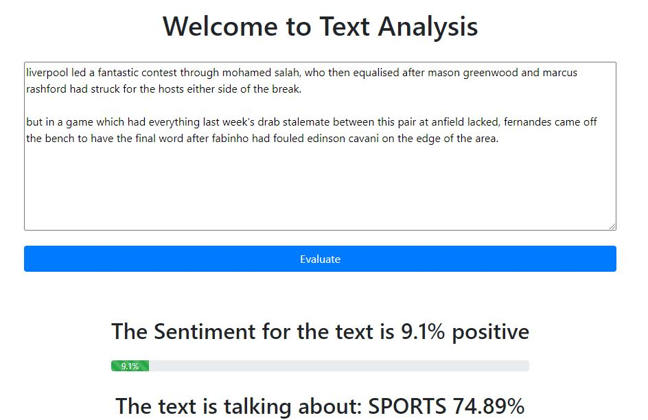
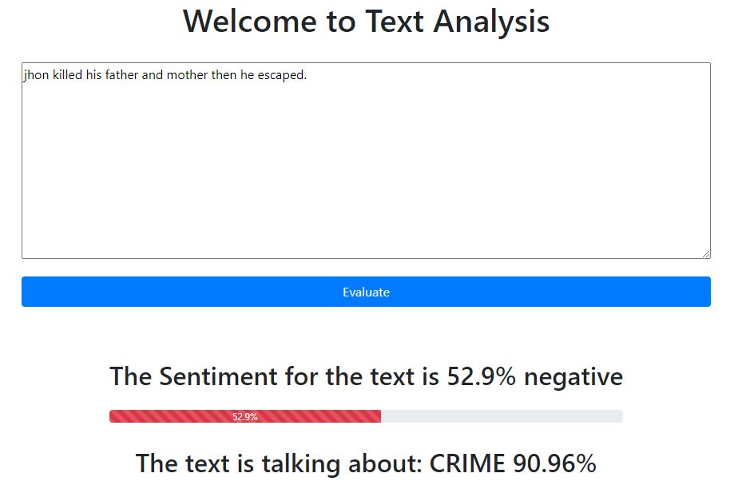
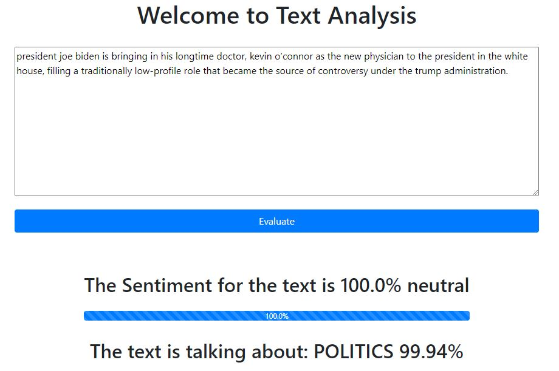
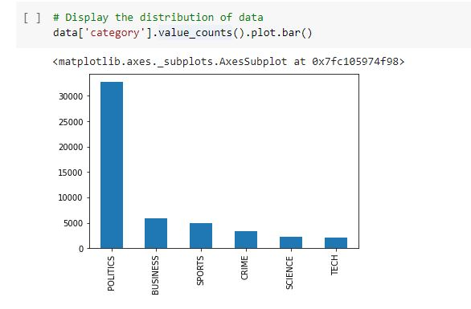
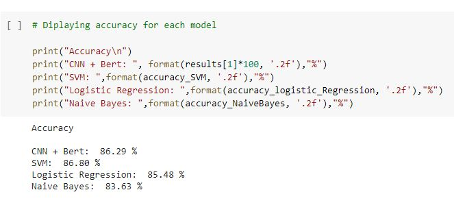
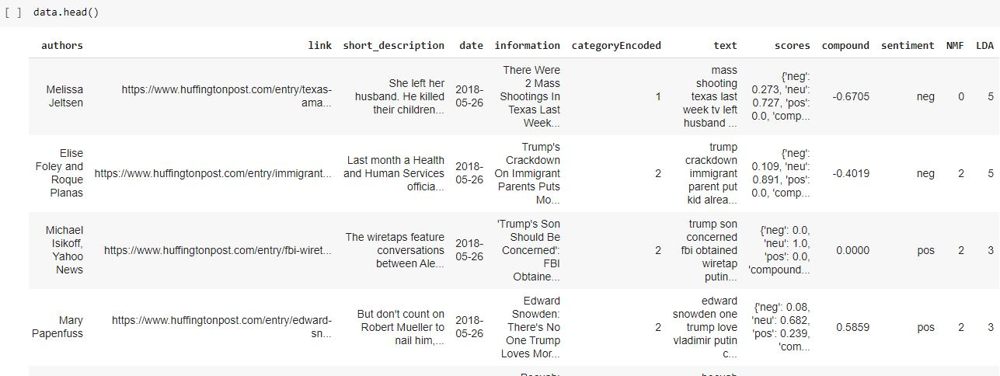

# Text Analysis And Category Classification

This project contain: text category classification, sentiment analysis and topic modeling. And it is integrated in a web application using Flask.

✅ Keywords: Python, Text Mining, NLP, CNN, Bert, Flask


## requirement

```shell

pip install pandas pickle random gzip gensim  logging tensorflow keras tensorflow bert math re transformers numpy metrics sklearn seaborn matplotlib pyplot

```


## Run

```shell

# 1 Open   main.py   and run main function if you are using IDE  

# 2 Run with python

python3 main.py

# 3 look at the file    model.ipynb    see the model for your self

```







 

 


