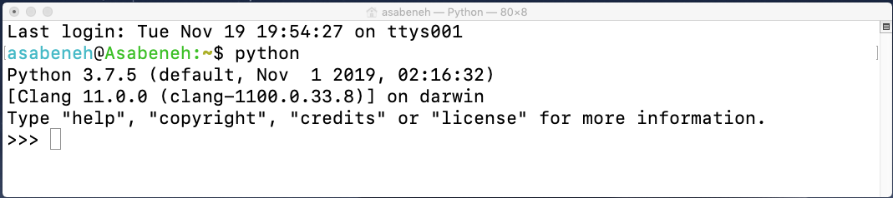

# 🐍 30 Days Of Python 

|# Day | Topics                                                    |
|------|:---------------------------------------------------------:|
| 01  |  [Introduction](./readme.md)|
| 02  |  [Variables, Built-in Functions](./02_Day_Variables_builtin_functions/02_variables_builtin_functions.md)|
| 03  |  [Operators](./03_Day_Operators/03_operators.md)|
| 04  |  [Strings](./04_Day_Strings/04_strings.md)|
| 05  |  [Lists](./05_Day_Lists/05_lists.md)|
| 06  |  [Tuples](./06_Day_Tuples/06_tuples.md)|
| 07  |  [Sets](./07_Day_Sets/07_sets.md)|
| 08  |  [Dictionaries](./08_Day_Dictionaries/08_dictionaries.md)|
| 09  |  [Conditionals](./09_Day_Conditionals/09_conditionals.md)|
| 10  |  [Loops](./10_Day_Loops/10_loops.md)|
| 11  |  [Functions](./11_Day_Functions/11_functions.md)|
| 12  |  [Modules](./12_Day_Modules/12_modules.md)|
| 13  |  [List Comprehension](./13_Day_List_comprehension/13_list_comprehension.md)|
| 14  |  [Higher Order Functions](./14_Day_Higher_order_functions/14_higher_order_functions.md)|     
| 15  |  [Python Type Errors](./15_Day_Python_type_errors/15_python_type_errors.md)| 
| 16 |  [Python Date time](./16_Day_Python_date_time/16_python_datetime.md) |     
| 17 |  [Exception Handling](./17_Day_Exception_handling/17_exception_handling.md)|    
| 18 |  [Regular Expressions](./18_Day_Regular_expressions/18_regular_expressions.md)|    
| 19 |  [File Handling](./19_Day_File_handling/19_file_handling.md)|
| 20 |  [Python Package Manager](./20_Day_Python_package_manager/20_python_package_manager.md)|
| 21 |  [Classes and Objects](./21_Day_Classes_and_objects/21_classes_and_objects.md)|
| 22 |  [Web Scraping](./22_Day_Web_scraping/22_web_scraping.md)|
| 23 |  [Virtual Environment](./23_Day_Virtual_environment/23_virtual_environment.md)|
| 24 |  [Statistics](./24_Day_Statistics/24_statistics.md)|
| 25 |  [Pandas](./25_Day_Pandas/25_pandas.md)|
| 26 |  [Python web](./26_Day_Python_web/26_python_web.md)|
| 27 |  [Python with MongoDB](./27_Day_Python_with_mongodb/27_python_with_mongodb.md)|
| 28 |  [API](./28_Day_API/28_API.md)|
| 29 |  [Building API](./29_Day_Building_API/29_building_API.md)|
| 30 |  [Conclusions](./30_Day_Conclusions/30_conclusions.md)|


- [🐍 30 Days Of Python](#-30-days-of-python)
- [📘 Day 1](#-day-1)
    - [Python Shell](#python-shell)
      - [Example](#example)
  - [Basic Python](#basic-python)
    - [Python Syntax](#python-syntax)
    - [Python Indentation](#python-indentation)
    - [Comments](#comments)
    - [Data types](#data-types)
      - [Number](#number)
      - [String](#string)
      - [Booleans](#booleans)
      - [List](#list)
      - [Dictionary](#dictionary)
      - [Tuple](#tuple)
      - [Set](#set)
    - [Checking Data types](#checking-data-types)
    - [Python File](#python-file)
  - [💻 Exercises - Day 1](#-exercises---day-1)
    - [Exercise: Level 1](#exercise-level-1)
    - [Exercise: Level 2](#exercise-level-2)
    - [Exercise: Level 3](#exercise-level-3)

# 📘 Day 1

```shell
python --version
```


### Python Shell

```shell
python
```




Let us do some maths first before we write any Python code:

- 2 + 3 = 5
- 3 - 2 = 1
- 3 \* 2 = 6
- 3 / 2 = 1.5
- 3 ^ 2 = 3 x 3 = 9

In python we have the following additional operations:

- 3 % 2 = 1 => which means finding the remainder
- 3 // 2 = 1 => remove number of point after dot (.)

#### Example

```py

5 / 2 -> 2.5
5 // 2 -> 2 

```


- double slash (//) work like one slash (/) but double slash don't care about number of point after dot (.) so removed no matter what is value of this point

This is how you write a comment in python

```shell
 # comment starts with hash
 # this is a python comment, because it starts with a (#) symbol
```


## Basic Python

### Python Syntax

A Python script can be written in Python interactive shell or in the code editor. A Python file has an extension .py.

### Python Indentation

An indentation is a white space in a text. Indentation in many languages is used to increase code readability, however Python uses indentation to create block of codes. In other programming languages curly brackets are used to create blocks of codes instead of indentation. One of the common bugs when writing python code is wrong indentation.


### Comments

**Example: Single Line Comment**

```shell
    # This is the first comment
    # This is the second comment
    # Python is eating the world
```

**Example: Multiline Comment**

```shell

"""
This is multiline comment
multiline comment takes multiple lines.
python is eating the world
"""

'''
This is multiline comment
multiline comment takes multiple lines.
python is eating the world
'''

```

### Data types

#### Number

- Integer: Integer(negative, zero and positive) numbers
    Example:
    ... -3, -2, -1, 0, 1, 2, 3 ...
- Float: Decimal number
    Example
    ... -3.5, -2.25, -1.0, 0.0, 1.1, 2.2, 3.5 ...
- Complex
    Example
    1 + j, 2 + 4j

#### String

**Example:**

```py
'Asabeneh'
'Finland'
'Python'
'I love teaching'
'I hope you are enjoying the first day of 30DaysOfPython Challenge'
```

#### Booleans

**Example:**

```python
    True  #  Is the light on? If it is on, then the value is True
    False # Is the light on? If it is off, then the value is False
```

#### List

* using this quotes [ ] 

**Example:**

```py
[0, 1, 2, 3, 4, 5]  # all are the same data types - a list of numbers
['Banana', 'Orange', 'Mango', 'Avocado'] # all the same data types - a list of strings (fruits)
['Finland','Estonia', 'Sweden','Norway'] # all the same data types - a list of strings (countries)
['Banana', 10, False, 9.81] # different data types in the list - string, integer, boolean and float
```

#### Dictionary

* using this quotes { } and this quotes [ ] inside if you want use it

A Python **dictionary object** is an **unordered collection** of data in a key value pair format. 

**Example:**

```py
{
  'first_name':'Asabeneh',
  'last_name':'Yetayeh',
  'country':'Finland', 
  'age':250, 
  'is_married':True,
  'skills':['JS', 'React', 'Node', 'Python']
}
```

#### Tuple

* using this quotes ( ) 

A tuple is an **ordered collection** of different data types like list but tuples **can not be modified** once they are created. They are immutable.

**Example:**

```py
('Asabeneh', 'Pawel', 'Brook', 'Abraham', 'Lidiya') # Names
```

```py
('Earth', 'Jupiter', 'Neptune', 'Mars', 'Venus', 'Saturn', 'Uranus', 'Mercury') # planets
```

#### Set

* using this quotes { } 

Unlike list and tuple, set is **not an ordered collection** of items. Like in Mathematics, set in Python stores **only unique items**.

**Example:**

```py
{2, 4, 3, 5}
{3.14, 9.81, 2.7} # order is not important in set
```

### Checking Data types

* we use **type** to check data type of value
  


### Python File

**Example:**

The file name is (helloworld) with extension of **.py** in the end you will see that (helloworld.py)


```py
# Day 1 - 30DaysOfPython Challenge

print(2 + 3)             # addition(+)
print(3 - 1)             # subtraction(-)
print(2 * 3)             # multiplication(*)
print(3 / 2)             # division(/)
print(3 ** 2)            # exponential(**)
print(3 % 2)             # modulus(%)
print(3 // 2)            # Floor division operator(//)

# Checking data types
print(type(10))          # Int
print(type(3.14))        # Float
print(type(1 + 3j))      # Complex number
print(type('Asabeneh'))  # String
print(type([1, 2, 3]))   # List
print(type({'name':'Asabeneh'})) # Dictionary
print(type({9.8, 3.14, 2.7}))    # Set
print(type((9.8, 3.14, 2.7)))    # Tuple
```

<div align = "center">


</div>

To run the python file check the image below. You can run the python file either by running the green button on Visual Studio Code or by typing *python helloworld.py* in the terminal .


🌕  You are amazing. You have just completed day 1 challenge and you are on your way to greatness. Now do some exercises for your brain and muscles.

## 💻 Exercises - Day 1

### Exercise: Level 1

1. Check the python version you are using
2. Open the python interactive shell and do the following operations. The operands are 3 and 4.
   - addition(+)
   - subtraction(-)
   - multiplication(\*)
   - modulus(%)
   - division(/)
   - exponential(\*\*)
   - floor division operator(//)
3. Write strings on the python interactive shell. The strings are the following:
   - Your name
   - Your family name
   - Your country
   - I am enjoying 30 days of python
4. Check the data types of the following data:
   - 10
   - 9.8
   - 3.14
   - 4 - 4j
   - ['Asabeneh', 'Python', 'Finland']
   - Your name
   - Your family name
   - Your country

### Exercise: Level 2

1. Create a folder named day_1 inside 30DaysOfPython folder. Inside day_1 folder, create a python file helloworld.py and repeat questions 1, 2, 3 and 4. Remember to use _print()_ when you are working on a python file. Navigate to the directory where you have saved your file, and run it.

### Exercise: Level 3

1. Write an example for different Python data types such as Number(Integer, Float, Complex), String, Boolean, List, Tuple, Set and Dictionary.
2. Find an [Euclidian distance](https://en.wikipedia.org/wiki/Euclidean_distance#:~:text=In%20mathematics%2C%20the%20Euclidean%20distance,being%20called%20the%20Pythagorean%20distance.) between (2, 3) and (10, 8)

